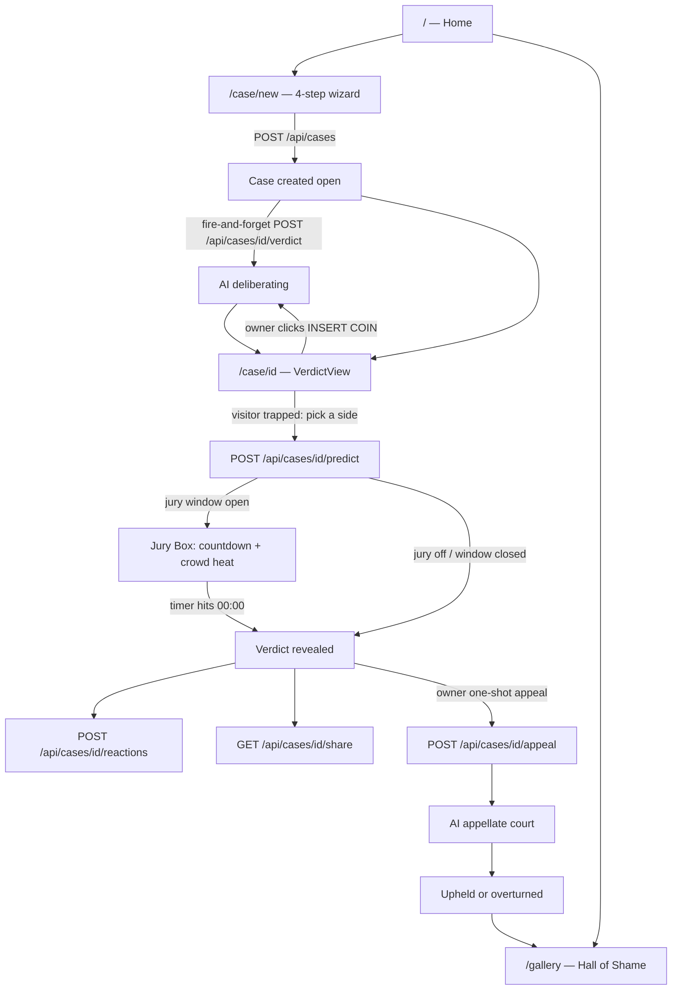

# BEEF — LLM Handoff Document

> **Purpose:** Give any LLM (or human) enough context to work on this codebase without re-discovering architecture, flows, and conventions.
>
> **Last updated:** 2026-07-14 · **Package:** `beef` v0.1.0 · **Repo folder:** `judge/`

---

## 1. What is BEEF?

**BEEF** is a viral, arcade-themed web app where two people submit both sides of an internet argument and an AI judge delivers a dramatic verdict — complete with scores, reasoning, and a "fatal roast."

**Tagline:** *Settle arguments with AI. Two sides. One verdict. Zero mercy.*

**Aesthetic:** Retro coin-op / fighting-game UI — pixel sprites, Press Start 2P font, CRT scanlines, neon arcade colors, courtroom backgrounds.

**No user accounts.** Anonymous browser sessions identify case owners, voters, and rate-limit buckets.

---

## 2. User flows (end-to-end)



### Home (`src/app/page.tsx`)
- Arcade splash: "INSERT COIN TO START"
- CTAs: **INSERT CASE** → `/case/new`, **HALL OF SHAME** → `/gallery`
- Stat tiles: 2P Players / 1 Verdict / 00 Mercy

### Case creation (`/case/new`)
**4-step wizard** (`src/components/case/CaseSubmissionForm.tsx`):

| Step | Component | Fields |
|------|-----------|--------|
| dispute | `DisputeStep.tsx` | title (5–120), category |
| side-a | `PartyStep.tsx` | name (≤24), argument (30–3000), evidence (≤1000) |
| side-b | `PartyStep.tsx` | same for player 2 |
| review | `ReviewStep.tsx` | judge tone: savage / sharp / balanced · **JURY MODE toggle** (optional 5-min crowd court) |

On submit:
1. `POST /api/cases` → returns `{ case_id, status: "open" }`
2. Fire-and-forget `POST /api/cases/{id}/verdict` with chosen tone
3. Navigate to `/case/{id}`

### Case / verdict page (`/case/[id]`)
**`VerdictView.tsx`** (client component) handles the viral state machine, in priority order:

| State | Who sees it | Behavior |
|-------|-------------|----------|
| **THE TRAP** | Any non-owner who hasn't voted (whatever the case status) | Arguments blurred ("ARGUMENT SEALED"); must smash `SIDE WITH {NAME}` to proceed. Copy: "YOU HAVE BEEN SUMMONED. PICK A SIDE TO UNSEAL THE VERDICT." |
| **THE JURY BOX** | Everyone (owner included) while `jury.active` | Pulsing red MM:SS countdown to `jury_expires_at`, live Crowd Heat bar, viewer's bet. Verdict sealed for all. Owner also gets deliberation status/error/summon inline |
| Open, no verdict | Owner | "INSERT COIN & DECIDE" → summons judge |
| Deliberating | Owner + voted visitors | Animated scales sprite + terminal logs; polls `GET /api/cases/{id}` every 1.2s |
| Verdict revealed | Owner, and voters once jury window closed (or jury off) | Fighter cards, HP bars, roast, **THE PEOPLE VS THE JUDGE panel** (crowd vs AI: ABSOLUTE CONSENSUS / THE CROWD WAS WRONG / HUNG JURY), reactions, share, appeal |

**Jury mode timing:** the countdown is driven by server-supplied `jury.remaining_ms` (local deadline re-derived on every poll); at 00:00 the client refetches immediately and the poll loop (runs while `jury.active`) flips everyone on the page to the reveal.

**Appeal:** Owner of the *losing* side files one plea (20–600 chars). AI appellate court upholds or overturns. Successful overturn flips `effectiveWinnerSide`.

### Gallery / Hall of Shame (`/gallery`)
- Closed cases ranked by time-decayed **heat** (not raw `viral_rank`)
- Top-3 podium + scoreboard table
- `export const dynamic = "force-dynamic"`

### Sharing
- `GET /api/cases/{id}/share` → `SharePackage` (winner/loser text, OG image URL)
- OG images generated at `GET /api/og` (edge, store-free query params)
- Appeal roast/image supersedes original verdict in share package

---

## 3. Tech stack

| Layer | Choice |
|-------|--------|
| Framework | **Next.js 14.2** (App Router, `src/` directory) |
| Language | TypeScript 5, React 18 |
| Database | **Convex** (document DB + server functions) |
| Validation | Zod 4 |
| Animation | Framer Motion 12 |
| Styling | Tailwind CSS 3.4 + custom arcade CSS (`globals.css`) |
| AI | **Cursor Background Agents API** → default model `gemini-3.5-flash` |
| Fonts | Cinzel (display), DM Sans (body), JetBrains Mono, Press Start 2P (arcade) |

**Important architectural choice:** The UI talks **only to Next.js REST routes**, never directly to Convex hooks. All DB access goes through `src/lib/store/db.ts` (thin `fetchQuery`/`fetchMutation` wrapper).

---

## 4. Directory map

```
judge/
├── convex/
│   ├── schema.ts          # DB tables + indexes
│   ├── cases.ts           # All queries & mutations
│   ├── lib.ts             # Mappers, heat math, docket counter
│   └── _generated/        # Auto-generated Convex types
├── src/
│   ├── app/
│   │   ├── layout.tsx     # Root layout, fonts, metadata
│   │   ├── page.tsx       # Home
│   │   ├── globals.css    # Arcade design system (416 lines)
│   │   ├── case/
│   │   │   ├── new/page.tsx
│   │   │   └── [id]/
│   │   │       ├── page.tsx      # Server: loads envelope, metadata
│   │   │       └── VerdictView.tsx  # Client: main case UI
│   │   ├── gallery/page.tsx
│   │   └── api/
│   │       ├── cases/route.ts
│   │       ├── cases/[id]/route.ts
│   │       ├── cases/[id]/verdict/route.ts
│   │       ├── cases/[id]/appeal/route.ts
│   │       ├── cases/[id]/predict/route.ts
│   │       ├── cases/[id]/reactions/route.ts
│   │       ├── cases/[id]/share/route.ts
│   │       └── og/route.tsx      # Edge OG image generation
│   ├── components/
│   │   ├── case/          # Wizard steps
│   │   ├── gallery/       # HallOfShameTable
│   │   ├── layout/        # CourtroomBackground, PageTransition, Header, BackLink
│   │   ├── pixel/         # PixelIcon, PixelFrame, ScalesWeighSprite
│   │   ├── providers/     # ConvexClientProvider (optional, mostly unused for data)
│   │   └── ui/            # Button, Input, Textarea
│   ├── lib/
│   │   ├── session.ts     # Anonymous cookie sessions
│   │   ├── rate-limit.ts  # In-memory per-session buckets
│   │   ├── api-error.ts
│   │   ├── actions/cases.ts   # createCase, getShareablePackage
│   │   ├── cursor/        # Cursor Agents API client
│   │   ├── store/db.ts    # Convex wrapper (single data-access layer)
│   │   ├── validators/case-form.ts
│   │   └── verdict/       # engine.ts, prompt.ts, analysis.ts
│   └── types/index.ts     # Domain types + helpers (source of truth for DTOs)
├── public/
│   ├── cyber-judge-bg*.png    # Page backgrounds (mobile/desktop)
│   └── pixel/                 # Sprite assets (buttons, fighters, badges, etc.)
├── scripts/               # Python asset pipeline (not runtime)
└── .smoke/                # Saved smoke-test JSON payloads
```

---

## 5. Data model

All fields use **snake_case** intentionally (future SQL migration). Types in `src/types/index.ts` mirror Convex docs 1:1.

### Tables (`convex/schema.ts`)

| Table | Purpose | Key fields |
|-------|---------|------------|
| `counters` | Sequential docket numbers | `name`, `value` |
| `cases` | Core case record | `title`, `category`, `status`, `docket_no`, `owner_session_id`, `viral_rank`, `deliberating`, `appealing`, error columns, `jury_enabled` + `jury_expires_at` (optional; JURY MODE window = created_at + 5 min, `JURY_WINDOW_MS` in `convex/lib.ts`) |
| `parties` | Side A & B arguments | `case_id`, `side`, `display_name`, `argument_text`, `evidence_summary` |
| `verdicts` | One per case (idempotent) | `winner_side`, `short_verdict`, `full_reasoning`, `roast_line`, `share_image_url`, optional `scores`, `shame_score` |
| `appeals` | One per case (idempotent) | `outcome` (upheld/overturned), `plea`, `ruling`, `roast_line`, `share_image_url` |
| `reactions` | Crowd emoji reactions | `type` (shock/laugh/agree), `count` |
| `crowdVotes` | Pre-reveal predictions | `session_id`, `side` |

### Categories
`food`, `relationships`, `roommates`, `work`, `money`, `gaming`, `petty`, `other`

### Virality math (`convex/lib.ts`)
- `viral_rank = viral_seed + Σ(reaction_count × weight)` where weights: shock=3, laugh=2, agree=1
- `viral_seed` set from AI `shame_score / 2` (clamped) on verdict; appeal adds +8 (upheld) or +20 (overturned)
- **Heat** (gallery ranking): `viral_rank` decayed with 72-hour half-life from `last_activity_at` — computed at read time, never stored

### Scoring (fight math)
- Per side: `logic` (0–10) + `evidence` (0–10)
- **Weighted total** = `logic × 2 + evidence` (max 30)
- Higher weighted total **must** win; server rejects contradictory AI output and retries
- Blowout tiers (margin): ≥8 = FLAWLESS VICTORY, ≥14 = FATALITY
- `weightedScore()` in `src/types/index.ts` must mirror `computeWeightedScore()` in `analysis.ts` exactly

### `CaseEnvelope` (main API response shape)
Returned by `GET /api/cases/[id]` and Convex `getEnvelope`:
- `case`, `parties`, `verdict`, `appeal`, `reactions`, `crowd`, `jury`, `deliberation`, `appeal_state`, `viewer`
- `verdict_sealed: true` when verdict exists but is masked — until non-owner votes, or for EVERYONE (owner included) while the jury window is open
- `verdict: null` when no verdict yet OR sealed
- `jury: { enabled, active, expires_at (ISO|null), remaining_ms }` — `getEnvelope` takes a required `now` arg (epoch ms) injected by `db.ts` so the query stays deterministic (no `Date.now()` inside Convex queries)

---

## 6. API routes

All routes: Zod validation, session from cookie, in-memory rate limits, court-themed error messages.

| Method | Path | Rate limit | Notes |
|--------|------|------------|-------|
| `POST` | `/api/cases` | 10/hr | Create case + 2 parties. Optional `jury_enabled: boolean` (default false) |
| `GET` | `/api/cases/[id]` | — | Full `CaseEnvelope` |
| `POST` | `/api/cases/[id]/verdict` | 10/hr | Body: optional `{ tone }`. Returns 202, starts AI loop |
| `POST` | `/api/cases/[id]/appeal` | 5/hr | Body: `{ plea }` 20–600 chars. Returns 202 |
| `POST` | `/api/cases/[id]/predict` | 30/min | Body: `{ side: "A"\|"B" }`. Owner gets 403. Response is seal-aware: `{ crowd, verdict, appeal, verdict_sealed, jury }` — verdict stays null while jury window open |
| `POST` | `/api/cases/[id]/reactions` | 60/min | Body: `{ type }`. Increments + recomputes viral_rank |
| `GET` | `/api/cases/[id]/share` | — | `SharePackage`. 409 if no verdict yet. Includes `jury_votes` + `crowd_approval_pct` (% of jurors who sided with the final winner), appended to `share_text` and as `jury` param on the OG image URL |
| `GET` | `/api/og` | — | Edge OG image (query params, no DB). Optional `jury` (0–100) renders a "JURY n% AGREED" chip |

---

## 7. Convex functions (`convex/cases.ts`)

**No Convex auth** — trust boundary is Next.js API layer passing `session_id`.

### Queries
- `getEnvelope` — assembles full case view incl. seal logic (vote gate + jury window), crowd tally, jury state, owner flag. Requires `now` (epoch ms) from the caller
- `get`, `getParties`, `getVerdict`, `getAppeal`, `getReactions`
- `getCrowdTally` — bare `{ A, B }` vote counts (used by the share package)
- `listPrecedents` — last 3 closed cases (for AI prompt context)
- `listGallery` — closed cases sorted by `computeHeat`

### Mutations
- `create` — case + 2 parties + zeroed reactions + docket allocation; `jury_enabled: true` stamps `jury_expires_at = now + JURY_WINDOW_MS`
- Deliberation locks: `tryLockDeliberation`, `unlockDeliberation`, `recordDeliberationError`, `clearDeliberationError`
- `insertVerdict` — idempotent, closes case
- `setViralSeed`, `addViralSeedBonus`, `incrementReaction`
- Appeal locks: `tryLockAppeal`, `unlockAppeal`, `recordAppealError`, `clearAppealError`
- `insertAppeal` — idempotent
- `castCrowdVote`

### Lock semantics
- `STALE_LOCK_MS = 10 minutes` — crashed deliberation/appeal can be reclaimed
- `findCase` uses `normalizeId` so malformed URL IDs return null (not throw)

---

## 8. AI / verdict engine

### Flow (`src/lib/verdict/engine.ts`)

1. API route calls `startVerdictGeneration` / appeal equivalent
2. Acquire Convex lock (sync guard → immediate 403/404/409/503)
3. **Fire-and-forget** async loop in Next.js process (⚠️ not serverless-safe)
4. Build prompt with up to 3 precedents → Cursor agent → poll run → parse JSON
5. Up to 3 attempts with repair prompts on validation failure
6. Success: `insertVerdict`, `setViralSeed`, build OG URL, clear error, unlock
7. Failure: `recordDeliberationError`, unlock

### Cursor client (`src/lib/cursor/client.ts`)
- `POST https://api.cursor.com/v1/agents` — create agent
- `POST .../runs` — start run (with repair follow-ups)
- `GET .../runs/{id}` — poll every 2s, max 60 attempts
- Auth: Basic `key:` (base64)

### Prompts (`src/lib/verdict/prompt.ts`)
- Persona: **"BEEF — a dramatic AI judge"**
- Tones: savage (full roast), sharp (surgical), balanced (stern/fair)
- Output: raw JSON only — `winner_side`, `scores`, `shame_score`, `short_verdict`, `full_reasoning`, `roast_line`
- Hard rules against roasting protected characteristics
- Appeal persona: **"BEEF sitting as the APPELLATE COURT"** — strict standard, most appeals upheld

### Validation (`src/lib/verdict/analysis.ts`)
- Strips code fences, extracts JSON slice, Zod validates
- **Rejects** if `winner_side` contradicts computed weighted scores → triggers repair round
- `estimateShameScore` fallback from score margin

---

## 9. Session & auth

**File:** `src/lib/session.ts`

- Cookie: `beef_session` (httpOnly, sameSite=lax, 1-year, secure from `x-forwarded-proto`)
- Value: anonymous UUID
- **Owner** = `cases.owner_session_id === session_id`
  - Can summon judge, file appeal (loser only)
  - Cannot cast crowd vote (403)
- **Rate limits** keyed per session
- **Crowd vote** deduped per `(case_id, session_id)`

---

## 10. OG / share images

**File:** `src/app/api/og/route.tsx` (edge runtime, `ImageResponse` 1200×630)

Arcade KO screen with:
- Press Start 2P font (bundled at `src/app/api/og/PressStart2P-Regular.ttf`)
- Fighter panels + "JUDGE PWR" HP bars
- "FATAL ROAST" quote box
- Appeal stamp: "OVERTURNED" / "APPEAL DENIED"

**Query params:** `title`, `winner`, `verdict`, `roast`, `case`, `na`, `nb`, `wa`, `wb`, `stamp`, `jury` (crowd approval %, appended fresh at share time — not stored on the verdict row)

URLs built in `engine.ts` (`buildShareImagePath` / `buildAppealShareImagePath`) and stored on verdict/appeal rows.

`generateMetadata` in `case/[id]/page.tsx` **bypasses vote seal** so link-preview crawlers get the OG card.

---

## 11. Key frontend components

| Component | Role |
|-----------|------|
| `CourtroomBackground` | Per-route mobile/desktop BG crossfade + CRT overlays |
| `PageTransition` | Framer-motion exit animations (FrozenRouter pattern) |
| `Header` | Brand "BEEF", nav to new case + gallery |
| `PixelIcon` | Central asset map (~22 sprites), pixelated rendering |
| `PixelFrame` | Bordered arcade panels (yellow/pink/blue/green variants) |
| `ScalesWeighSprite` | 8-frame CSS sprite animation during deliberation |
| `HallOfShameTable` | Gallery scoreboard with rank medals, heat, reactions |
| `ConvexClientProvider` | Wraps app; gracefully no-ops if Convex URL missing |

### Design tokens (`globals.css`)
- CSS variables: `--arcade-*`, `--court-*`
- Utility classes: `arcade-panel`, `crt-flicker`, `neon-glow-*`, `shame-board`, `font-arcade`
- Tailwind extends these for the arcade aesthetic

---

## 12. Environment variables

```bash
# Required for AI verdicts/appeals (503 without it)
CURSOR_API_KEY=

# Optional, defaults to gemini-3.5-flash
CURSOR_MODEL_ID=gemini-3.5-flash

# Optional absolute base for share URLs (falls back to request origin)
NEXT_PUBLIC_APP_URL=

# Filled by `npx convex dev`
CONVEX_DEPLOYMENT=
NEXT_PUBLIC_CONVEX_URL=
NEXT_PUBLIC_CONVEX_SITE_URL=

# Optional: alternate build dir (Windows .next lock workaround)
NEXT_DIST_DIR=
```

---

## 13. Development workflow

```bash
# Terminal 1 — Convex backend (watches schema + functions)
npm run dev:backend   # or: npx convex dev

# Terminal 2 — Next.js frontend
npm run dev

# Lint
npm run lint

# Production build
npm run build && npm run start
```

**Both processes must run** for full functionality. Frontend alone works for static pages; case CRUD and verdicts need Convex + `CURSOR_API_KEY`.

---

## 14. Known limitations & gotchas

| Issue | Detail |
|-------|--------|
| **Deliberation in-process** | AI loop runs fire-and-forget in the Next.js Node process. Comment in `engine.ts` says move to queue/worker before serverless deploy. |
| **In-memory rate limits** | `src/lib/rate-limit.ts` uses a `Map` — not shared across instances or serverless invocations. |
| **No Convex auth** | All Convex functions are public; session checks happen only in Next.js API routes. |
| **Backward-compatible verdicts** | Older verdicts may lack `scores` / `shame_score`; UI must fall back gracefully. |
| **Vote seal bypass for OG** | Crawlers see verdict metadata; humans must vote first. Intentional viral hook. |
| **Windows build lock** | Use `NEXT_DIST_DIR` if dev server holds `.next` exclusively. |
| **Session cookie rename** | Cookie is `beef_session` (renamed from `arbitrator_session` during BEEF rebrand). |

---

## 15. Conventions for contributors / LLMs

1. **Snake_case** for all DB/API field names — do not camelCase persisted fields.
2. **Data access** only through `src/lib/store/db.ts` — never call Convex from components.
3. **UI → REST only** — components fetch `/api/*`, not `useQuery(api.cases.*)`.
4. **Idempotency** on verdict/appeal inserts — check before writing.
5. **Weighted score rule** must stay in sync between `types/index.ts` and `verdict/analysis.ts`.
6. **Normalize user input** — `normalizeName` strips control/zero-width chars (prompt injection guard).
7. **Playful error messages** — API errors use court/arcade voice ("The judge needs a recess").
8. **Minimal diffs** — match existing patterns; don't over-abstract.
9. **Pixel assets** — add to `PixelIcon` asset map, place files in `public/pixel/`.
10. **Brand name is BEEF** everywhere user-facing (metadata, share text, AI persona, header).

---

## 16. Quick reference — files to read first

| Task | Start here |
|------|------------|
| Understand a case's full state | `convex/cases.ts` → `getEnvelope` |
| Change verdict logic | `src/lib/verdict/engine.ts`, `prompt.ts`, `analysis.ts` |
| Change case UI | `src/app/case/[id]/VerdictView.tsx` |
| Change submission form | `src/components/case/CaseSubmissionForm.tsx` |
| Add API endpoint | `src/app/api/`, wire through `src/lib/store/db.ts` |
| Change DB schema | `convex/schema.ts` + `src/types/index.ts` |
| Change gallery ranking | `convex/lib.ts` → `computeHeat` |
| Change share/OG | `src/lib/actions/cases.ts`, `src/app/api/og/route.tsx` |
| Change styling | `src/app/globals.css`, Tailwind config |

---

## 17. Brand & copy

| Context | Value |
|---------|-------|
| Site name | **BEEF** |
| Page title | `BEEF — Viral Decision Engine` |
| AI persona | `BEEF — a dramatic AI judge` |
| Share prefix | `BEEF RULES (CASE #0042):` |
| Subtitle (header) | `COIN_OP_DECISION_ENGINE` |
| Home hook | `INSERT COIN TO START` |

---

*This document should be updated when schema, API contracts, or major flows change.*
